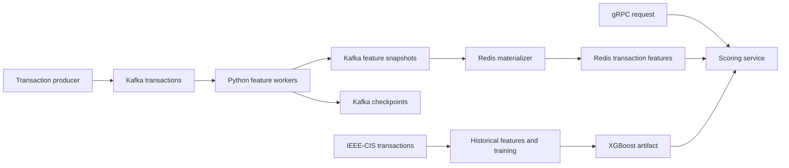

# Real-Time Fraud Detection & Risk Scoring Pipeline

I built this project to explore the two hard parts of real-time fraud detection together: keeping behavioral features correct when workers fail, and serving a model fast enough to score a transaction while it is still relevant.

I chose **Python, Kafka, Redis, XGBoost, and gRPC**, with Docker Compose for local development and Terraform for an AWS EC2 deployment. The implementation includes the pipeline, training and serving code, correctness tests, and benchmark tools. The large-scale performance targets below still need to be measured on a running stack.

## Why I designed it this way

- **Kafka owns durable processing state.** I commit input offsets, feature outputs, and entity checkpoints in the same Kafka transaction. A restarted worker restores committed state before consuming again.
- **Redis is a serving projection.** I can rebuild it from Kafka. Its writes are idempotent, and conflicting versions of the same transaction snapshot fail explicitly.
- **Each score uses one exact transaction snapshot.** I look up features by entity ID and transaction ID so a request cannot accidentally use behavior from later transactions.
- **Batch and streaming share feature definitions.** I compute historical features using the same window boundaries as the online worker, then compare them against an independent reference in tests.
- **I started with fixed partition ownership.** Each worker owns one Kafka partition and has a stable transactional ID. This keeps recovery inspectable; dynamic partition reassignment is a future extension.
- **I keep the demo model explicit.** Local Compose defaults to a labeled heuristic so the full flow can be exercised before downloading training data. A trained XGBoost model replaces it when its artifact is available.



## Features I compute

I use event-time windows that include the lower boundary and exclude the current timestamp: `[t - window, t)`. Transactions at the same timestamp do not contribute to each other's features. History is scoped to an entity and retained for one hour for feature computation.

| Features | Window or reference |
| --- | --- |
| Transaction count, total spend | 1 minute, 5 minutes, 1 hour: six features |
| Mean amount | 5 minutes |
| Maximum amount | 1 hour |
| Distinct merchants | 1 hour |
| Seconds since previous transaction | Previous event in retained history |
| Geographic distance, implied travel speed | Previous event in retained history, when both locations exist |

That gives me 12 behavioral features. The model also receives the current transaction amount. Missing history and coordinates remain missing values.

For the first version, I reject events older than their entity's last accepted timestamp and events more than one hour behind the partition watermark. Rejected events go to a Kafka topic; I do not silently revise earlier scores. I deduplicate transaction IDs within an entity for a 24-hour event-time horizon.

## Run the local demo

I use Python 3.12 for development. On Windows PowerShell, run these commands from the repository root:

```powershell
python -m venv .venv
.\.venv\Scripts\python.exe -m pip install -c constraints.txt -e '.[dev]'
.\.venv\Scripts\python.exe -m pytest -q
.\.venv\Scripts\fraud.exe demo
```

The in-process demo works without Docker and clearly labels its score as an untrained heuristic. It writes `reports/local-demo.json`.

For the full Kafka -> Redis -> gRPC flow, install and start Docker Desktop with Linux containers, then run:

```powershell
Copy-Item .env.example .env
.\.venv\Scripts\fraud.exe generate --count 1000

docker compose up --build -d
.\.venv\Scripts\python.exe scripts/smoke.py

docker compose run --rm producer
```

The smoke test produces its own events, waits for Redis materialization, verifies offline/online parity, and makes a gRPC scoring request. The producer command replays `data/transactions.jsonl` for further inspection and load tests.

To score one of those transactions after the producer finishes:

```powershell
$transaction = Get-Content data/transactions.jsonl -First 1 | ConvertFrom-Json
.\.venv\Scripts\fraud.exe score --entity $transaction.entity_id --transaction $transaction.transaction_id
```

If a snapshot has not reached Redis yet, the API returns `NOT_FOUND`; retry after checking consumer progress. Snapshots older than 24 hours are rejected by the scoring service. Generate a fresh input file for a new demo day.

```powershell
docker compose logs --tail 100 worker-0 materializer scorer
docker compose --profile monitoring up -d
# Grafana: http://localhost:3001 on my workstation (default port: 3000)
# Prometheus: http://localhost:9090
docker compose down
```

`docker compose down` retains data volumes. See the runbook before resetting durable state.

My local `.env` uses the trained model (`ALLOW_DEMO_MODEL=0`), Grafana port 3001, and scorer metrics port 8001 because ports 3000 and 8000 are already occupied. These ports are configurable through `GRAFANA_PORT` and `SCORER_METRICS_PORT`.

I can run a short trained-model load check without a separate k6 installation:

```powershell
docker compose --profile benchmarks run --rm k6
```

## Train the model

I use the labeled IEEE-CIS transaction file, split chronologically into training, validation, and held-out test periods. The training command fits XGBoost and a logistic regression baseline, then saves evaluation metrics, model parameters, feature order, and data/model checksums.

```powershell
.\.venv\Scripts\fraud.exe train --input ../ieee-fraud-detection/train_transaction.csv --output artifacts/model
```

I use anonymized card/address fields as an **entity proxy**, not a verified account identity. IEEE-CIS does not provide the explicit coordinates needed for my geographic features, so I validate those using synthetic coordinates. This adapter uses the transaction table only; it does not currently incorporate the identity table or the full anonymized feature set. Its AUC must be measured rather than inferred from other IEEE-CIS models.

After training, change `ALLOW_DEMO_MODEL=0` in `.env` and recreate the scoring container:

```powershell
docker compose up -d --force-recreate scorer
```

The API returns an uncalibrated **risk score**, its model version, and its feature version. I do not present it as a calibrated fraud probability.

## Targets I want to validate

| Experiment | Target | Current status |
| --- | --- | --- |
| Kafka feature processing | 50k+ committed transactions/sec without growing lag | Unmeasured |
| Worker crash recovery | 100+ process-kill trials with no missing or double-counted events | 65 trials passed; campaign stopped on Kafka connectivity failure at trial 66; rerun after stack stability |
| Held-out IEEE-CIS ROC-AUC | Above 0.90 | Initial behavioral baseline: **0.6723** on 88,081 held-out rows; target not met |
| gRPC scoring | p99 <100 ms at 5k+ successful requests/sec | Short 100-RPS smoke check passed at p99 **3.97 ms**; 5k RPS remains unverified |
| Redis reads | Client-observed p99 <1 ms | Initial Windows-to-Docker test: p99 **7.46 ms** at concurrency 16; target not met |

I started with full touched-entity checkpoints and straightforward window scans to make the implementation easy to audit. Hot accounts, checkpoint size, and Redis write throughput will need profiling before I can claim the throughput target. This is a single-broker development topology, not a high-availability production deployment.

## Project map

```text
src/fraud_pipeline/     Feature engine, Kafka workers, Redis store, training, gRPC, CLI
contracts/             Protobuf service definition
scripts/               Smoke test, protobuf generation, real worker crash trials
benchmarks/            k6 scoring workload and concurrent Redis read benchmark
tests/                 Reference, checkpoint, model, and real local gRPC tests
infra/                 Monitoring configuration and EC2 Terraform
reports/               Local validation notes and generated evidence
```

I documented the remaining setup and operational decisions here:

- [External setup checklist](docs/EXTERNAL_SETUP.md): Docker, Kaggle data, optional AWS setup.
- [Architecture and consistency contract](docs/ARCHITECTURE.md): ordering, checkpoint recovery, retention, and limitations.
- [Benchmark guide](docs/BENCHMARKS.md): commands and evidence needed for each target.
- [Operations runbook](docs/RUNBOOK.md): backfill, recovery, model rollout, deployment, and teardown.
- [Local validation](reports/VALIDATION.md): what has actually been checked in this workspace.
- [Reproduce the checks](docs/REPRODUCIBILITY.md): interpreter selection, read-only protobuf verification, and separate external validation gates.
- [IEEE-CIS baseline](reports/IEEE_BASELINE.md): my first real-data training result and its limitations.

## License

See [LICENSE](LICENSE).
