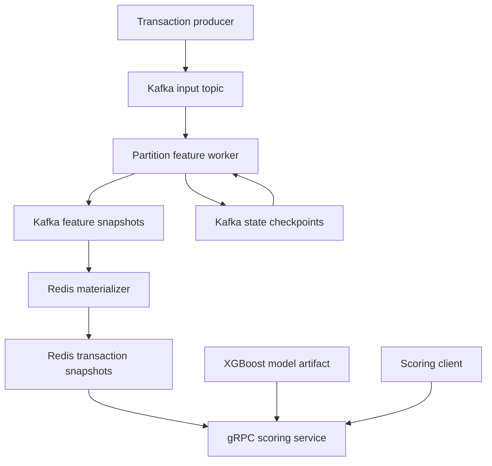

# Real-Time Fraud Detection & Risk Scoring Pipeline

A Python service that processes transaction events, maintains historical behavior features and serves versioned risk scores over gRPC. Kafka stores the durable processing state; Redis provides transaction-specific feature snapshots for inference.

The project focuses on **recoverable stream processing, consistent feature computation and model serving**. It includes a local Docker stack, an XGBoost training workflow, correctness tests, monitoring and reproducible benchmark tools.

[Source repository](https://github.com/ShreyashDhakate/Real-Time-Fraud-Detection)

## Features

- **12 behavioral features** computed from event-time windows, including transaction frequency, spend and geographic movement when coordinates are available.
- **Kafka transaction checkpoints** that commit feature outputs, processing state and input offsets together.
- **Idempotent Redis materialization** using Lua scripts to detect conflicting transaction snapshots.
- **gRPC scoring** with input validation, request deadlines, freshness checks and explicit model/feature versions.
- **Shared batch and streaming definitions**, checked against independent reference calculations.
- **Chronological model evaluation** with XGBoost and a logistic regression baseline.
- **Docker Compose**, Prometheus/Grafana configuration and GitHub Actions checks.

## Architecture



Each worker owns one explicitly assigned partition. It restores committed state before processing new events. The Redis materializer consumes committed feature snapshots and writes immutable snapshots keyed by entity and transaction ID.

| Component | Responsibility |
| --- | --- |
| `domain.py` | Transaction validation, feature windows, deduplication and state expiration |
| `streaming.py` | Partition ownership, Kafka transactions and checkpoint recovery |
| `store.py` | Redis snapshot storage and materialization |
| `model.py` | Training, model artifacts and inference |
| `serving.py` | gRPC transport, scoring checks and request metrics |
| `cli.py` | Demo, generation, replay, training, backfill and scoring commands |

### Consistency contract

Kafka offsets, output records and entity checkpoints are committed in the same Kafka transaction. Redis is a separately materialized projection: writes can be retried without silently replacing a conflicting snapshot. Kafka and Redis are **not** committed as one cross-system transaction.

Partition ownership is static in this implementation. Starting another worker for the same partition requires the same stable transactional identity and recovery rules; automatic consumer-group rebalancing is not implemented.

## Feature definitions

Windows use `[t - window, t)`. The lower boundary is included; the current timestamp is excluded. Events at the same timestamp do not contribute to each other's history.

| Feature group | Definition | Count |
| --- | --- | ---: |
| Transaction count | 1-minute, 5-minute and 1-hour windows | 3 |
| Total spend | 1-minute, 5-minute and 1-hour windows | 3 |
| Mean transaction amount | 5-minute window | 1 |
| Maximum transaction amount | 1-hour window | 1 |
| Distinct merchants | 1-hour window | 1 |
| Time since previous transaction | Previous event in retained history | 1 |
| Distance and implied travel speed | Previous event, when both locations are present | 2 |

The model also receives the current transaction amount. Missing history and coordinates remain missing values.

Transaction IDs are deduplicated per entity within a 24-hour event-time horizon. Events older than the entity's last accepted timestamp, or more than one hour behind the partition watermark, are rejected rather than used to revise an earlier score.

## Getting started

### Requirements

- Python **3.12 or later**, as declared in `pyproject.toml`.
- Git.
- Docker with the Compose plugin for the full Kafka/Redis stack.
- The labeled IEEE-CIS transaction CSV for real-data training; it is not needed for the in-process demo.

### 1. Install the project

```bash
git clone https://github.com/ShreyashDhakate/Real-Time-Fraud-Detection.git
cd Real-Time-Fraud-Detection
python3 -m venv .venv
source .venv/bin/activate
python -m pip install -c constraints.txt -e '.[dev]'
```

On Windows PowerShell, use `python -m venv .venv` and activate with `.\.venv\Scripts\Activate.ps1`, then run the same installation command.

### 2. Run without external services

```bash
python -m pytest -q
fraud demo
```

The demo processes synthetic events in memory and writes `reports/local-demo.json`. Its score is explicitly labeled as an **untrained heuristic**. It does not exercise Kafka or Redis.

### 3. Start the complete local pipeline

```bash
cp .env.example .env
fraud generate --count 1000
docker compose up --build -d
python scripts/smoke.py
docker compose run --rm producer
```

In PowerShell, replace `cp .env.example .env` with `Copy-Item .env.example .env`.

The smoke script produces 20 synthetic events, waits for Redis snapshots, compares streaming features with batch features and requests a gRPC score. The producer command subsequently replays the generated transaction file.

Generate fresh events for a new demo session: scoring rejects snapshots older than its configured maximum age.

### 4. Request a score

Read an entity/transaction pair from the generated file, then call:

```bash
fraud score --entity ENTITY_ID --transaction TRANSACTION_ID
```

Replace the two arguments with an actual pair from `data/transactions.jsonl`. The command connects to `localhost:50051` by default. A score can return `NOT_FOUND` while its snapshot is still being materialized.

### 5. Inspect or stop the stack

```bash
docker compose logs --tail 100 worker-0 materializer scorer
docker compose --profile monitoring up -d
docker compose down
```

`docker compose down` retains the Kafka and Redis data volumes. Follow the [runbook](docs/RUNBOOK.md) before resetting durable processing state.

## Configuration

Docker Compose reads `.env`. The Python CLI reads **exported environment variables**, not `.env` automatically.

| Setting | Default | Purpose |
| --- | --- | --- |
| `KAFKA_BOOTSTRAP_SERVERS` | `localhost:19092` for the host CLI | Broker connection |
| `REDIS_URL` | `redis://localhost:6379/0` for the host CLI | Feature store connection |
| `PIPELINE_NAMESPACE` | `fraud` | Topic, group and key namespace |
| `KAFKA_PARTITIONS` | `4` | Partition count |
| `WORKER_PARTITION` | `0` | Explicit worker partition |
| `BATCH_SIZE` | `100` | Worker batch size |
| `FEATURE_TTL_SECONDS` | `86400` | Redis snapshot retention |
| `ALLOW_DEMO_MODEL` | `1` in Compose | Permit the labeled heuristic model |
| `GRAFANA_PORT` | `3000` | Host port for the monitoring UI |
| `SCORER_METRICS_PORT` | `8000` | Host port for scorer metrics |

Compose uses internal service addresses for container-to-container communication. The local gRPC endpoint is `localhost:50051`; Prometheus is `localhost:9090` when the monitoring profile is enabled.

## Model training

```bash
fraud train --input /path/to/train_transaction.csv --output artifacts/model
```

Training uses chronological train/validation/test periods. It writes a model artifact and metadata containing evaluation metrics, feature order and checksums. Set `ALLOW_DEMO_MODEL=0` in `.env` after training, then recreate the scorer:

```bash
docker compose up -d --force-recreate scorer
```

The IEEE-CIS adapter uses anonymized card/address fields as entity proxies. It does not use the identity table or the complete anonymized feature set. Coordinates are unavailable in this dataset, so geographic feature behavior is checked with synthetic data.

The API exposes an **uncalibrated risk score**, not a calibrated fraud probability.

## gRPC contract

The service definition is [`contracts/fraud.proto`](contracts/fraud.proto).

| RPC | Request | Response |
| --- | --- | --- |
| `fraud.v1.FraudScorer/Score` | `entity_id`, `transaction_id` | `risk_score`, `model_version`, `feature_version`, `feature_age_seconds`, `demo_model` |

Explicit errors cover invalid input, unavailable stores, missing snapshots, stale/future timestamps and expired request deadlines. An incompatible snapshot-schema rejection remains a documented validation gap; see [scoring failure checks](docs/SCORING_FAILURES.md).

## Tests and validation

```bash
python -m pytest -q
python -m ruff check src tests scripts benchmarks --exclude src/fraud_pipeline/generated
python scripts/generate_proto.py --check
python -m pip check
```

Coverage includes feature boundaries, duplicate/late input, batch/stream parity, checkpoint restoration, model artifact behavior and localhost gRPC contracts. Some known gaps are tracked with strict expected-failure tests; a passing test run should be read together with those results.

The external recovery harness runs actual worker subprocess crashes:

```bash
python -m scripts.crash_trials --trials 2 --output reports/crash-trials.json
```

Use an isolated local stack. Checkpoint simulations and worker process-kill trials are different validation exercises.

## Recorded results

The figures below come from the repository's recorded local validation. They are not new measurements or production capacity guarantees.

| Experiment | Recorded result | Scope |
| --- | --- | --- |
| Trained-model gRPC smoke test | **3,001 successful scores**, approximately **100 RPS**, **p99 3.97 ms**, no errors or dropped iterations | 30-second local run; pre-materialized features |
| Redis reads | **p99 7.46 ms**, 100% hit rate | 10,000 GETs, concurrency 16, Windows host to Docker |
| IEEE-CIS model baseline | **ROC-AUC 0.6723** | 88,081 held-out rows; chronological split |
| Worker crash campaign | **65 passing trials** | Campaign stopped at trial 66 on Kafka connectivity failure |

Raw scoring and Redis reports are in [`reports/evidence/`](reports/evidence/). Model results and context are in [`reports/IEEE_BASELINE.md`](reports/IEEE_BASELINE.md) and [`reports/VALIDATION.md`](reports/VALIDATION.md).

The gRPC latency measures serving from already materialized features; it does **not** measure ingestion-to-decision latency. Sustained 50k-event/sec processing, 5k scoring RPS and sub-millisecond Redis reads remain targets, not established results.

### Reproduce performance checks

After training and preparing fresh transaction snapshots:

```bash
docker compose --profile benchmarks run --rm k6
python benchmarks/redis_reads.py --reads 10000 --concurrency 16 --output reports/redis.json
```

The Compose k6 service requires a trained model. See the [benchmark guide](docs/BENCHMARKS.md) and [performance protocol](docs/PERFORMANCE_TEST_PLAN.md) for warm-up, workload, duration, success accounting and hardware reporting requirements.

## Current scope and next steps

- Single-broker local topology; high availability has not been demonstrated.
- Static partition ownership; dynamic reassignment remains future work.
- Full touched-entity checkpoints and straightforward history scans need profiling for hot entities.
- Remaining scoring-schema and benchmark-accounting gaps are documented in tests and validation notes.
- Terraform files describe an optional EC2 deployment path; AWS deployment is not part of the recorded validation.

## Documentation

- [Architecture and consistency](docs/ARCHITECTURE.md)
- [Reproduction guide](docs/REPRODUCIBILITY.md)
- [Operations runbook](docs/RUNBOOK.md)
- [External setup](docs/EXTERNAL_SETUP.md)
- [Model experiment protocol](docs/MODEL_EXPERIMENT.md)

## License

[MIT](LICENSE). Copyright 2026 Shreyash Dhakate.
